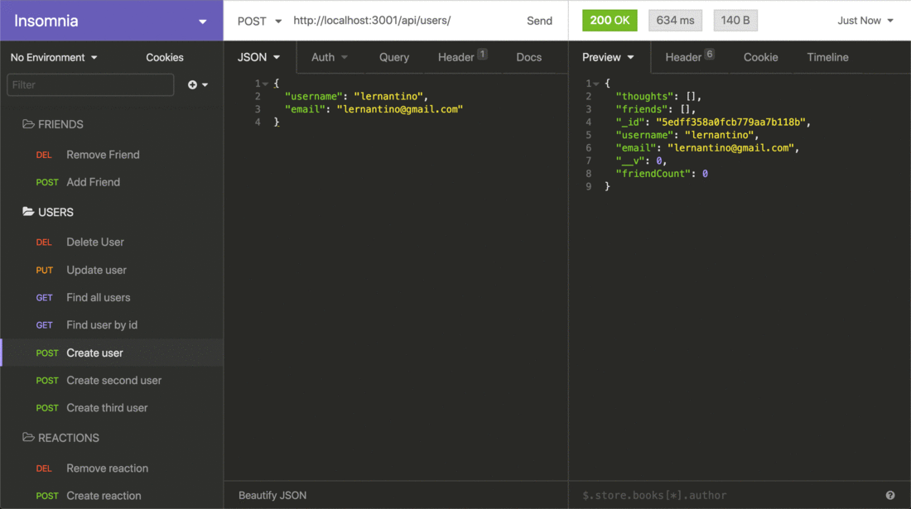

# Social_networking
Social_networking creates an API for a social network web application where users can share their thoughts, react to friends’ thoughts, and create a friend list. The following technologies have been used in order to create the application: Express.js for routing, a MongoDB database, and the Mongoose ODM.

Link to walkthrough video that demonstrates functionality: <a href= "https://drive.google.com/file/d/1JDplWpnaaeljHHIbYm53u9Hd95OoFbEw/view?usp=sharing">Social-networking video</a> 

Application GitHub URL : <a href= "https://github.com/monicadolce/Social_networking">Visit Monica's GitHub Repository</a> 